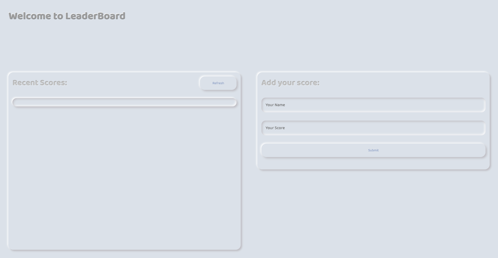

# LeaderBoard



## Description
The leaderboard website displays scores submitted by different players. It also allows you to submit your score. All data is preserved thanks to the external Leaderboard API service.

## Live Version
[Click Me 👈](https://samanatashi.github.io/LeaderBoard/dist/)

## Learning objective
- ES6 modules syntax
- Send and receive data from an API
- Asynchronous code

## Built With 
- HTML5 / CSS3
- JavaScript (ES6)
- Webpack

## Getting Started

### Prerequisites
> Please install [Node and NPM](https://nodejs.org/)  before moving forward

### Setup

```cmd
git clone  https://github.com/SamanAtashi/LeaderBoard.git
cd ./LeaderBoard
```
### Install

```cmd
npm install
```

```cmd
npm run build 
```
### Usage

```cmd
npm start
```

## Author

👤 **Saman Atashi**

- Twitter: [@AtashiSaman](https://twitter.com/AtashiSaman)
- GitHub: [@SamanAtashi](https://github.com/SamanAtashi)
- LinkedIn: [LinkedIn](https://www.linkedin.com/in/saman-atashi-9539911b0)

## 🤝 Contributing

Contributions, issues, and feature requests are welcome!

Feel free to check the [issues page](../../issues/).


## Show your support

Give a ⭐️ if you like this project!


## Acknowledgments

Microverse for giving me this chance

The amazing code reviewers for making me improve every day :thumbsup:
